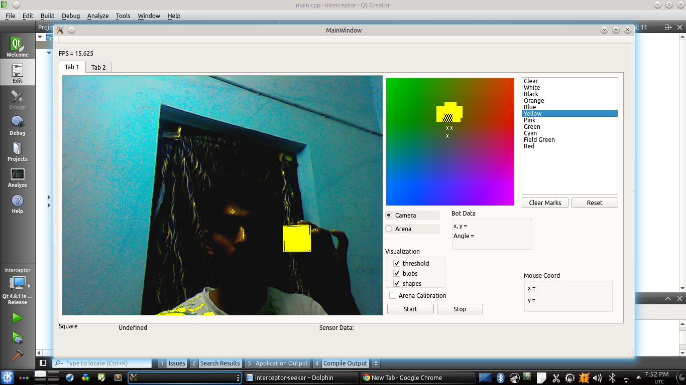

vision-featurematching
======================

scale invariant object matching on solid geometric shapes. Based on [vision](http://github.com/korroktheslavemaster/vision) project

##Features
* Allows training sets to be saved to a file.
* Shapes differentiated by colors as well
* Train on even single sample gives good scale invariant results.
* Eg shapes: squares, triangles, arrows, crosses etc.
* Algorithm: Creates bins to store edge data, for which a descriptor is made. NN matching with known descriptors.

